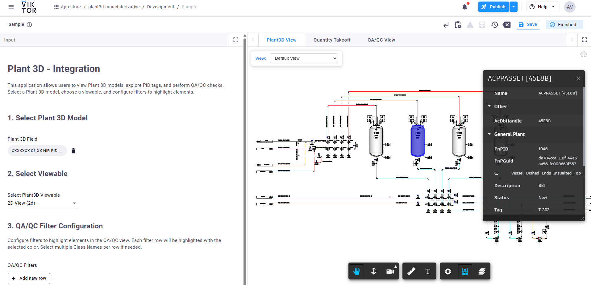
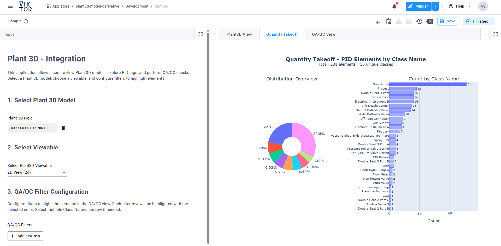
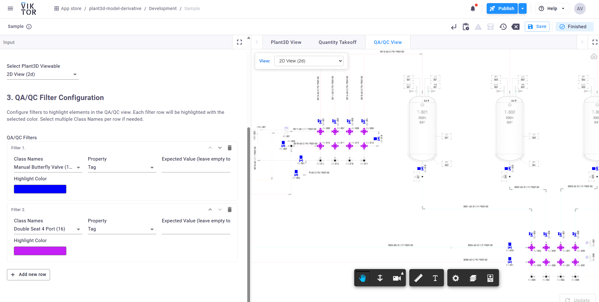

# Plant 3D Integration

A VIKTOR application for viewing, analyzing, and performing QA/QC checks on AutoCAD Plant 3D models from Autodesk Construction Cloud.

## Features

### Plant3D View
Browse and interact with your Plant 3D model. Click on elements to view their properties.

### Quantity Takeoff
Analyze PID element distribution by Class Name with an interactive pie chart and bar chart.

### QA/QC View
Highlight elements based on configurable filters: select Class Names, filter by property value, and choose custom highlight colors.

---

## Prerequisites

### Required Integrations
1. **Autodesk Construction Cloud (ACC)** - [Setup Guide](https://docs.viktor.ai/docs/create-apps/software-integrations/autodesk-construction-cloud/)
2. **Autodesk Platform Services (APS)** - [Setup Guide](https://docs.viktor.ai/docs/create-apps/software-integrations/autodesk-platform-services/)
   - Both require OAuth2 configuration